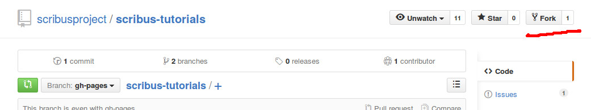
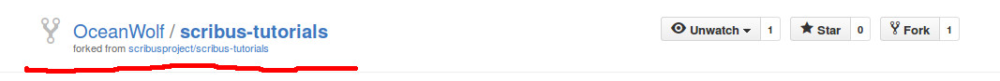

#Contributing to Scribus

So you want to give back to the Scribus community, well you have come to the right place to learn how to do so.

## Contributing content
Here we walk you though the three steps that you will need to take to contribute to these tutorials.

1. Setup (forking)
3. Edit the tutorials
4. Tell us about it

### Setup
First you need to create an account on [github](https://github.com/) this works like any other account creation, so we shall leave this up to you.

Next we need to create a copy of the tutorials to edit, fork github page, at https://github.com/scribusproject/scribus-tutorials where you should see a button called fork; in the picture below we have underlined this button in red.

Now you just have to press that button, and you will see it change from _scribusproject/scribus-tutorials_ to _YOUR-USERNAME/scribus-tutorials_, see the part we have underlined in the picture below.

Now, didn't that seem easy!  You now have the tutorials copied to your own work area on github.

### Editing/Creating tutorials
Before we can make our edits, we must first create a new branch.  This allows us to keep our edits in one place while keeping our original copy clean, this makes for good practice.  Branches let us group together changes.  To do this, just click on the branch selector and type in a new name and select "Create branch: ..." as depicted in the picture below.

Now for the creative part.  In the list of files and folders below you will see three main types of files (all other files you can ignore):
+ Files that end in ``\*.md``, these files contain the tutorial text which we call "markdown files";
+ File(s) named ``contents`` which contains an ordered list of the tutorials;

+ Image files, because we deal with plain text, images should get stored separately.

Feel free to take a look around these files.  The markdown files use a fairly intuitive language called markdown, you don't really need to worry about this, many tutorials exist on the internet about it, but don't feel scared.  As you can see it just looks like ordinary text.

**TODO FINISH THIS SECTION**

### Sharing your changes with the community
So you have now made some lovely changes to the tutorial files on your computer and now you want to share those changes with the community.  As with forking you have only a few steps to do.

**TODO FINISH THIS SECTION**
